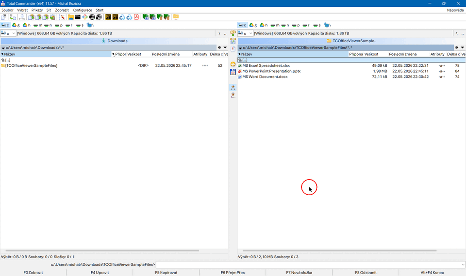

# TCOfficeView: a Total Commander Lister Plugin that Previews Microsoft Office Documents

[](https://github.com/michal-ruzicka/TCOfficeView/actions/workflows/build.yml)
[](https://github.com/sponsors/michal-ruzicka)
[](https://ko-fi.com/michal_ruzicka)
[](https://revolut.me/ruzicka_michal)

**A [Total Commander](https://www.ghisler.com/) Lister plugin that previews
Microsoft Office documents (Word, Excel, PowerPoint, Outlook MSG, Visio),
PDF, and anything else Windows Explorer's preview pane (`Alt+P`) can show,
directly in TC's `F3` / Quick View (`Ctrl+Q`) pane.**  Whatever Explorer
previews on your machine, this plugin previews in the Lister pane.

The plugin displays previews exactly the way Windows Explorer or Outlook
do — it does not parse documents itself, nor does it carry a managed
runtime.  For files it cannot preview (no handler installed for that
extension) the plugin steps aside and Total Commander uses your next
configured Lister plugin or its built-in viewer, so installing it never
takes anything away from you.

What you need on the target computer depends on the file type: MS Office
for Word / Excel / PowerPoint / Outlook content; nothing extra for PDF
on Windows 10+ (Microsoft Edge ships an in-the-box handler); whatever
application installs the handler for everything else.



**Project page:** <https://github.com/michal-ruzicka/TCOfficeView> — source
code, releases and issue tracker.

**Binary releases:** <https://github.com/michal-ruzicka/TCOfficeView/releases>

**Support:** If you find this plugin useful, consider supporting its development.

- <https://github.com/sponsors/michal-ruzicka> — GitHub Sponsors (GitHub account needed).

  [](https://github.com/sponsors/michal-ruzicka)

- <https://ko-fi.com/michal_ruzicka> — Buy me a Coffee with no specific account needed, card payment is possible.

  [](https://ko-fi.com/michal_ruzicka)

- <https://revolut.me/ruzicka_michal> — Donate me via Revolut, debet/credit card or Apple Pay.

  [](https://revolut.me/ruzicka_michal)

---

## Installation

The recommended way is the **Total Commander auto-installer:**

1. **Download** `TCOfficeView.vX.Y.Z.zip` from the [**latest release**](https://github.com/michal-ruzicka/TCOfficeView/releases).
2. In Total Commander, **navigate to the ZIP** file and press **Enter**.
3. TC detects the bundled `pluginst.inf` and asks whether to install the
   plugin — **confirm**.
4. Press **F3** or **Ctrl+Q** on a `.docx` / `.xlsx` / `.pptx` file to verify.

If you prefer to install manually, unzip the archive into a persistent
folder (for example `C:\Tools\TCOfficeView\`) and add `TCOfficeView.wlx`
(32-bit TC) or `TCOfficeView.wlx64` (64-bit TC) under **Configuration →
Options → Plugins → Lister plugins → Configure → Add**.

> **Upgrading from an earlier version?**  Total Commander keeps an
> already-configured detect string when a plugin is replaced, so
> users coming from v2.1 or earlier won't automatically pick up
> the new universal file-type support — see
> [Upgrading from an Earlier Version](#upgrading-from-an-earlier-version)
> below for how to refresh it.

### Verifying Releases

Each release ZIP is accompanied by a detached GPG signature file
(`TCOfficeView.vX.Y.Z.zip.asc`). Before installing, verify that the
archive has not been tampered with:

```
gpg --keyserver keys.openpgp.org --recv-keys 489C5EC80FD62BE89E59B4F719C13E8CE0F5DB61
gpg --verify TCOfficeView.vX.Y.Z.zip.asc TCOfficeView.vX.Y.Z.zip
```

GPG should report `Good signature from "Michal Růžička <ruzicka.mich@gmail.com>"`.
The full fingerprint of the signing key is `489C 5EC8 0FD6 2BE8 9E59  B4F7 19C1 3E8C E0F5 DB61`.

## Usage

There is no UI to configure at runtime — just press **F3** (or use Quick View
[**Ctrl+Q**]) on any supported file. The preview tracks the Lister pane size and
selecting a different file in the panel loads it into the same Lister session.

### Supported Formats

**Whatever Windows Explorer's preview pane (`Alt+P`) shows on your
machine.**  Common formats you can expect on a typical Windows + Office
installation:

| Source | Extensions |
|--------|------------|
| Microsoft Word        | DOC, DOCX, DOCM, RTF |
| Microsoft Excel       | XLS, XLSX, XLSM, XLSB |
| Microsoft PowerPoint  | PPT, PPTX, PPTM |
| Microsoft Visio       | VSD, VSDX |
| Outlook / Windows built-in mail previewer | MSG |
| Microsoft Edge (built-in) / Adobe Acrobat Reader | PDF |
| Adobe Photoshop (if installed) | PSD |
| AutoCAD / DWG TrueView (if installed) | DWG, DXF |
| Sketchup (if installed) | SKP |

…plus anything else whose installer registers a Windows Preview Handler.
There is no list of supported file types to maintain — install or
uninstall an application that ships a handler, and TCOfficeView picks
that up automatically the next time you use `F3` / `Ctrl+Q`.

> **Quick previews use a simplified rendering pipeline.** Office's
> built-in preview components — used by Windows Explorer's preview
> pane and by this plugin in the default mode — render through a
> reduced pipeline optimised for speed and stability inside a host
> window, not the full editing UI. For Word this means a flowing Web
> Layout without page breaks, headers or footers; Excel shows a
> simplified grid; PowerPoint shows static slides without transitions.
> An opt-in **Full mode** that launches the real Word, Excel or
> PowerPoint application and embeds its window into the Lister pane
> is available; see [Application Render Mode](#application-render-mode)
> below.

> **MSG and VSDX caveat.** The New Outlook (the modern rewrite) has
> dropped the classic `.msg` preview handler, and recent Visio installs
> sometimes omit the `.vsdx` handler. If Windows Explorer's own preview
> pane is also empty for a given file, the plugin falls back to the
> information panel.

### Configuration

Settings live in `TCOfficeView.ini`. The plugin reads it from two
locations and uses the **first one that exists** — values are not merged
across files:

1. `%APPDATA%\GHISLER\TCOfficeView.ini` — per-user override
2. `<plugin install dir>\TCOfficeView.ini` — system-wide default, shipped
   with the plugin

The shipped INI has every option commented out, so all defaults apply.
To customise, copy that file to `%APPDATA%\GHISLER\TCOfficeView.ini` and
edit the copy. Environment variables (`%TEMP%`, `%LocalAppData%`,
`%UserProfile%`, `%APPDATA%`, …) are expanded in any value.

#### Logging

Diagnostic logging is **off by default**. Turn it on by setting `LogPath`
under `[Logging]` to a writable file. Missing parent directories are
created on first write.

```ini
[Logging]
LogPath=%LocalAppData%\TCOfficeView\host.log
```

Leave the value empty (or comment it out) to disable logging.

#### Fallback Information Panel

Under `[FallbackUI]`:

- `FontFamily` — exact font name. Leave empty (the default) to auto-pick
  the first installed font from:
  Aptos Mono (Microsoft 365 / Office 2024) →
  Consolas (Windows Vista+) →
  Cascadia Mono (newer Windows) →
  Lucida Console (Windows 2000+) →
  Courier New (guaranteed final fallback).
- `FontSize` — font size in points; default `12`, clamped to `6..72`.
  The font is scaled to the actual monitor DPI when the panel is created.

```ini
[FallbackUI]
FontFamily=Cascadia Code
FontSize=13
```

#### Application Render Mode

Four values are accepted per application under `[Mode]`:

| Value | Render engine | Mode-switch button |
|---|---|---|
| `quick-switchable` **(default)** | Preview Handler | shown (→ Full) |
| `quick` | Preview Handler | hidden |
| `full-switchable` | OLE Automation (real app) | shown (→ Quick) |
| `full` | OLE Automation (real app) | hidden |

The **quick** engine is the built-in Office preview component hosted
inside the Lister pane. It is fast (~200–800 ms to first display) and
memory-light (~30–80 MB), but the rendering pipeline is simplified
(Word in Web Layout without page breaks, Excel in a simplified grid,
PowerPoint slides without transitions).

The **full** engine launches the real Word, Excel or PowerPoint
application in the background, opens the file read-only, and embeds
its main window into the Lister pane. It is slower (~2–4 s cold
start, ~100–300 MB per instance) but renders documents exactly as the
application would.

All three applications can be configured independently:

```ini
[Mode]
Word=quick-switchable
Excel=quick-switchable
PowerPoint=quick-switchable
```

The **`-switchable` variants** show a persistent overlay button in the
top-right corner of every Word / Excel / PowerPoint preview. One click
flips the current preview to the other engine without changing your INI
default. The switch is per-preview only — selecting another file (or
re-opening the same one) returns to the configured default. The button
is hidden for file types that have no full-mode equivalent (`.msg`,
`.vsdx`) regardless of the setting.

What full mode does for each application:

- **Word** — shows the document in Print Layout (page boundaries,
  headers, footers, page numbers) with the page scaled to the Lister
  pane width. The zoom re-fits automatically when you resize the
  pane. Rulers are hidden and the preview is truly read-only (typing
  in the document is blocked).
- **Excel** — opens the workbook read-only with the zoom set to
  100%. Excel's initial layout fills the Lister pane on load.
  **Known limits (full mode only — quick mode is unaffected):**
    - Excel does not relayout when the Lister pane is later resized;
      the content stays anchored to its initial area. Close the Lister
      (Esc) and reopen it with F3/Ctrl+Q to get a fresh layout at the
      new pane size.
    - Interaction with the embedded Excel (selecting cells, dragging
      a selection, clicking sheet tabs at the bottom, clicking ribbon
      controls) is unreliable. Excel internally checks whether it is
      the foreground top-level window before it processes much of its
      mouse input — and once it is reparented as a child of another
      process's window, those checks fail and clicks land in dead
      areas. Word and PowerPoint do far less of this kind of checking,
      which is why their full-mode embeds feel interactive even though
      they use the same reparenting technique. If you need to interact
      with the workbook, use **quick mode** (the default) — it does
      not have this limitation. Full mode is best treated as a
      visually faithful, mostly read-only viewer for Excel.
- **PowerPoint** — opens the presentation read-only with the slide
  scaled to fit the Lister pane. The zoom re-fits automatically when
  you resize the pane. PowerPoint's main window appears on screen for
  a fraction of a second before being embedded into the Lister (a
  brief visible flash); Word and Excel embed silently.

Full mode tradeoffs to be aware of:

- **Cold start ~2–4 s** the first time an Office document of a given
  application is opened. Subsequent documents of the *same*
  application within the *same* Lister window load faster (~0.5–1 s)
  because the running Office instance is reused. Switching between
  file types (`.docx` → `.xlsx`) quits the previous application and
  spins up the next one, so that switch pays the cold-start cost
  again.
- **Only one application embedded at a time.** The Lister pane is a
  single embed point — you cannot have a Word document and an Excel
  workbook visible in the same Lister.
- **Memory ~100–300 MB** per running Office instance.
- **Requires a full Microsoft Office installation** of the relevant
  application — not Office Viewer, not LibreOffice.
- **Falls back to quick mode** automatically on any failure (Office
  missing, document password-protected, …), so you always get
  *some* preview.
- **No global Office settings are changed.** Full mode only touches
  settings scoped to the open preview window — your standalone Word,
  Excel and PowerPoint will start up exactly as you left them. The
  ribbon, for example, stays visible in the preview because hiding
  it would hijack your global Office settings.

### When No Preview Handler Is Registered

If your machine has no Preview Handler at all for a given file type,
the plugin **silently steps aside** and Total Commander uses your next
configured Lister plugin or its built-in viewer instead.  Installing
TCOfficeView therefore never takes anything away from you — file types
it cannot handle keep working exactly the way they did before.

If a Preview Handler **is** installed but fails to render the file
(corrupt Office installation, broken handler, password-protected
document, …), the plugin shows a small information panel with the
file's basic details — name, full path, extension, size, and
created / modified / last-accessed timestamps — together with a brief
note about why the preview did not work.  This way the Lister never
shows an empty pane when a handler was advertised but couldn't deliver.

### Upgrading from an Earlier Version

Total Commander does **not** update an already-configured detect string
when you re-install or upgrade a plugin — it keeps whatever you (or the
previous installer) set originally.  This is fine for fresh installs
(the plugin announces `EXT="*"` and TC picks it up automatically) but
means upgraders from v2.1 or earlier keep their old detect string,
which lists only the original Office extensions and **never asks the
plugin about PDF, HTML, PSD, DWG and the rest**.

To pick up the new universal behaviour, do one of the following:

#### Option 1: Re-register the plugin (simpler)

1. Open **Configuration → Options → Plugins → Lister plugins → Configure**.
2. Select **TCOfficeView** and click **Remove**.
3. Close Total Commander completely and reopen it.
4. Either re-run the auto-installer (navigate to the release ZIP in
   TC and press Enter), or add the plugin back manually from the
   same dialog.

Total Commander will then ask the plugin DLL for its detect string
on first use and store the new `EXT="*"` value.

#### Option 2: Edit `wincmd.ini` directly

Total Commander's GUI does not expose a way to edit a Lister plugin's
detect string; it has to be changed in the configuration file.

1. Close Total Commander completely (don't leave it running — TC may
   overwrite `wincmd.ini` on exit with its in-memory copy).
2. Open `wincmd.ini` in a plain-text editor.  To find its location,
   in TC open **Configuration → Options → About**.  Common locations
   are the TC install directory or `%APPDATA%\GHISLER\wincmd.ini`.
3. Locate the `[ListerPlugins]` section.  You will see entries like:
   ```ini
   [ListerPlugins]
   0=C:\Program Files\Some other plugin\Foo.wlx
   0_detect=EXT="JPG"|EXT="PNG"
   1=C:\Users\<you>\AppData\Roaming\GHISLER\TCOfficeView\TCOfficeView.wlx64
   1_detect=EXT="DOC"|EXT="DOCX"|…|EXT="MSG"
   ```
4. Find the line whose value is the TCOfficeView plugin path (the
   `<N>=…` line).  Its companion `<N>_detect=…` line on the next row
   is the detect string for that plugin.
5. Replace the detect string value with:
   ```
   EXT="*"
   ```
   …so the line becomes for example `1_detect=EXT="*"`.
6. Save the file and reopen Total Commander.

If you would rather keep a stricter, finite set of file types instead
of `EXT="*"`, use this as the `<N>_detect=` value:

```
EXT="DOC"|EXT="DOCX"|EXT="DOCM"|EXT="RTF"|EXT="XLS"|EXT="XLSX"|EXT="XLSM"|EXT="XLSB"|EXT="PPT"|EXT="PPTX"|EXT="PPTM"|EXT="VSD"|EXT="VSDX"|EXT="MSG"|EXT="HTML"|EXT="HTM"|EXT="PDF"
```

With this list the plugin will be asked only about the common
formats; with `EXT="*"` it gets asked about every file but silently
steps aside for any file type Windows has no preview handler for.
The practical user experience is the same except for less common
formats (PSD, DWG, SKP, …) which only `EXT="*"` catches.

### Troubleshooting

**The plugin doesn't seem to do anything — I see TC's built-in viewer
instead.**  Your machine has no Preview Handler for that file type, so
the plugin steps aside (this is the intended behaviour, not a bug).
Easy way to confirm: open the file in Windows Explorer and press
`Alt+P` — if Explorer's preview pane is also empty, no handler is
installed.  Install (or repair) the application that owns the file
type and the preview will work in both places.

**I see the information panel instead of the real preview.**  A
Preview Handler is registered for the file type but it failed to
render this specific file.  Common causes: corrupted application
install (try a repair install), a password-protected document, or an
unusual file variant the handler does not support.

**TC crashes when previewing.**  This should not happen thanks to
process isolation — the actual preview runs in a separate helper
process.  If it does happen, the most likely cause is a 32-/64-bit
mismatch (for example a 64-bit Office where only a 32-bit Preview
Handler is registered).  Switch to the other bitness of the plugin.

**Need deeper diagnostics?**  Diagnostic logging can be turned on in
`TCOfficeView.ini` (see [Logging](#logging) above), and developer-level
troubleshooting notes — Event Viewer entries, registry keys to check,
the helper process name to look for — live in [CONTRIBUTING.md](CONTRIBUTING.md#diagnostics).

## Contributing

Build instructions, repo layout and architecture notes for developers live
in [CONTRIBUTING.md](CONTRIBUTING.md).

## License

This project is licensed under the Apache License 2.0 — see
[LICENSE.md](LICENSE.md) for the full text. Source files carry SPDX
identifiers (`SPDX-License-Identifier: Apache-2.0`). Release notes are in
[CHANGELOG.md](CHANGELOG.md).
